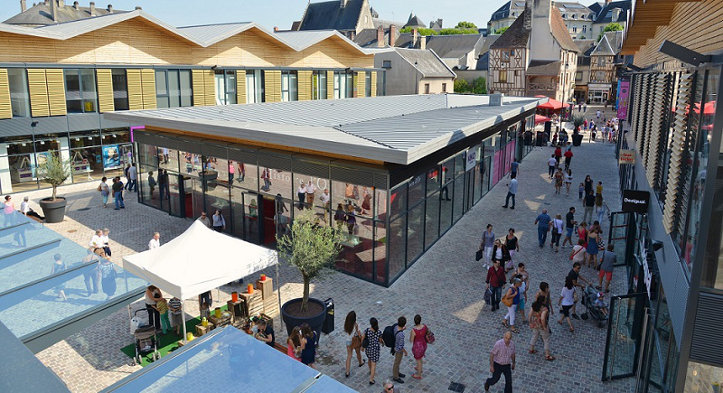
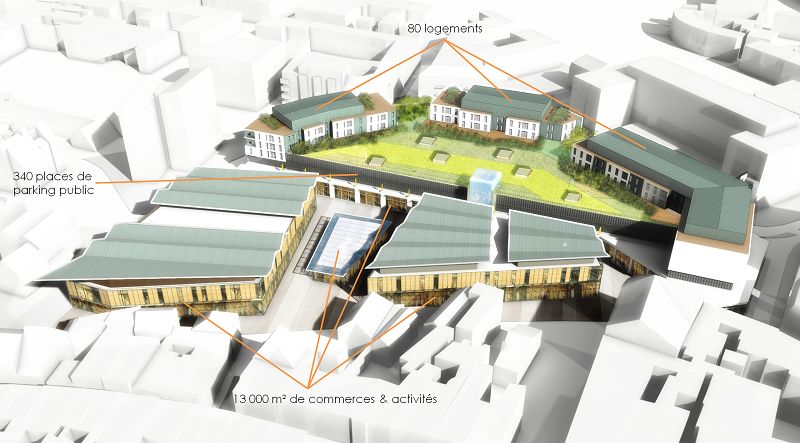
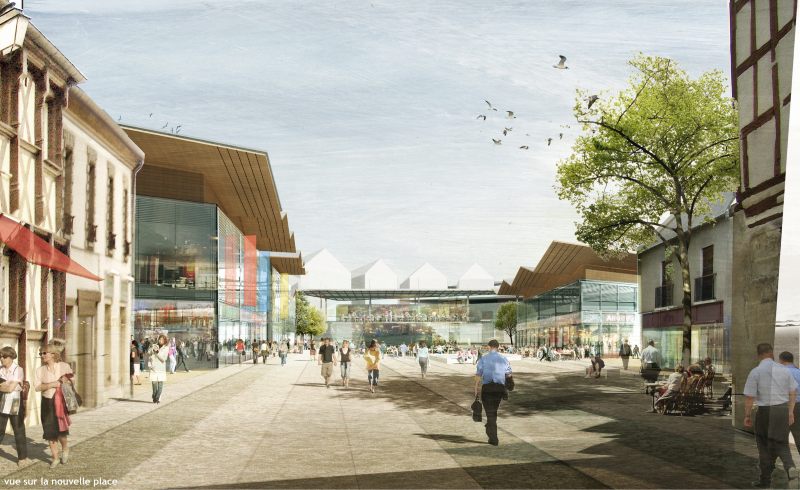

# About
New retail destination
Design Studies in 2007 for the regeneration of an urban block in the historical center of Bourges (65,000 pop.) in France. Project completed in 2015
Planning Area: 1ha
GFA: 26,000 m²
Arte Charpentier Architects & Frédéric Blatter
# Visuals
## Built

## Design studies

