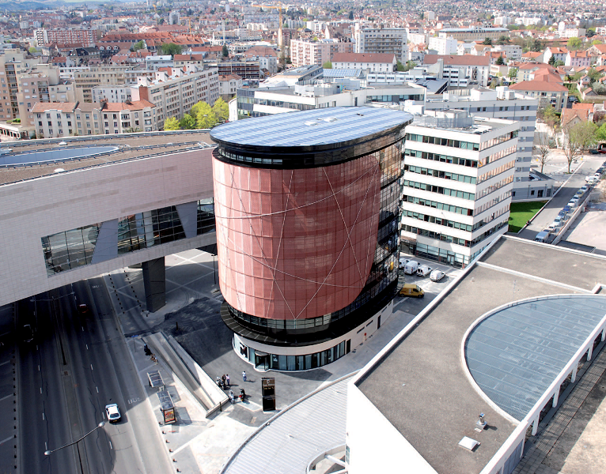
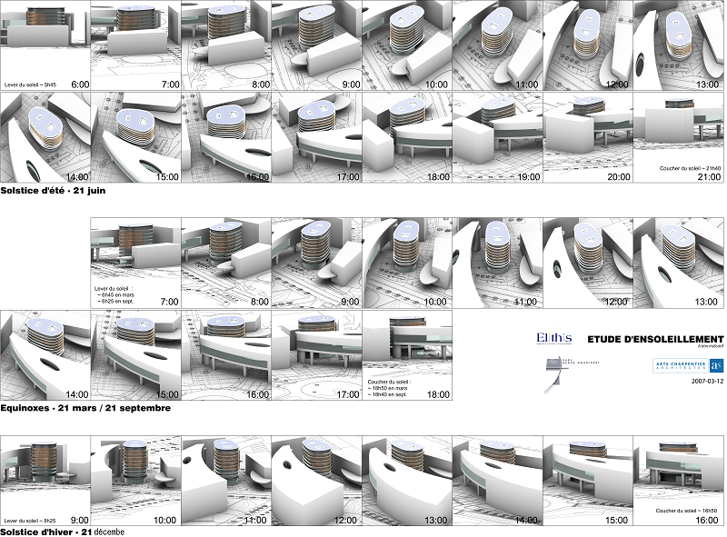

# About
Energy Efficient Building Elythis
Design Studies in 2007 for the construction of an office building in Dijon (65,000 pop.) in France. Project completed in 2008
GFA: 5,000 m²
Arte Charpentier Architects
# Visuals
## Built

## Design studies
