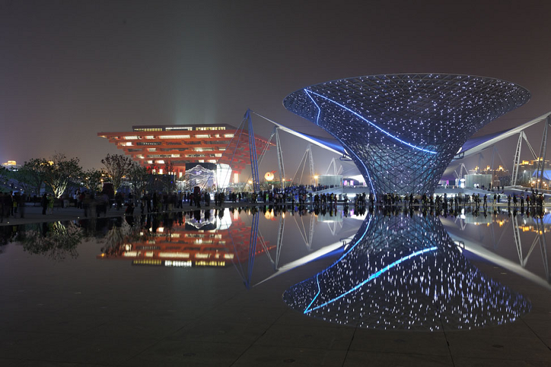
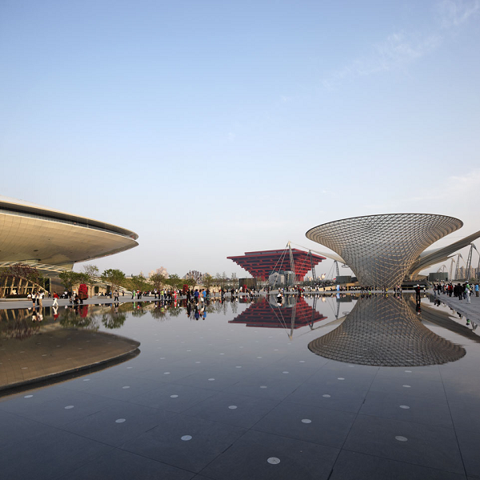
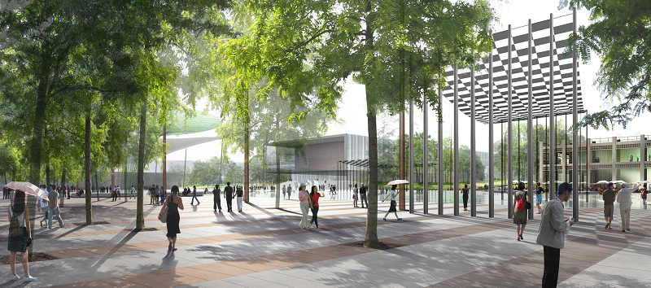
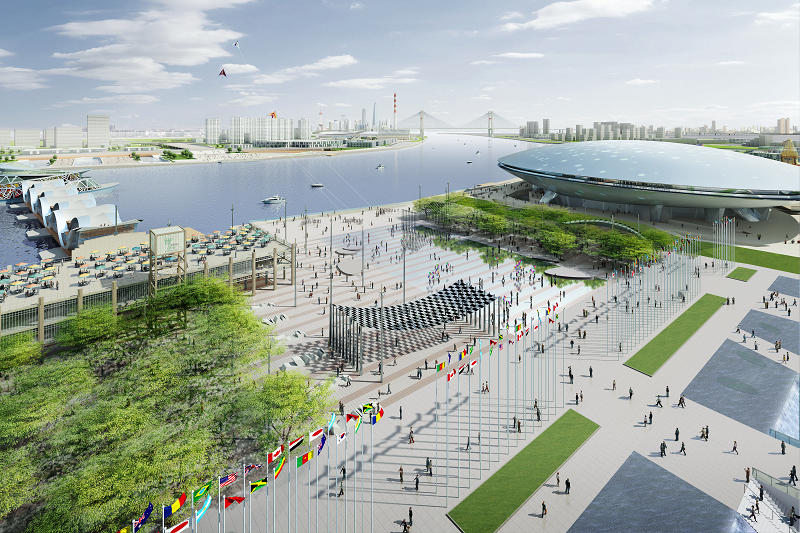

# About
Celebration plaza for Shanghai Expo 2010
Design Studies in 2007 for the landscape design of an outdoor public space along the Huangpu. 
Competition laureate. Project completed in 2010
Project Area: 15,000 m²
Arte Charpentier Architects and Bruno Fortier
# Visuals
## Built

## Design studies
